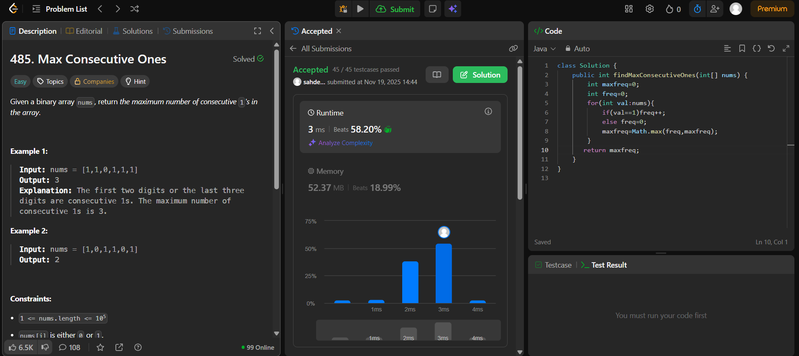

# 🧠 Day 10 – Arrays (Easy)

**📅 Date:** November 19, 2025  
**💻 Language:** Java  
**📚 Topic:** Arrays – Counting & Consecutive Element Tracking  

---

## ✅ Problems Solved
| Problem | LeetCode # | Description |
|:--|:--:|:--|
| [Max Consecutive Ones](https://leetcode.com/problems/max-consecutive-ones/) | #485 | Find the maximum number of consecutive `1`s in a binary array. |

---

## 💡 Concepts Practiced
- Used a **linear scan** to count consecutive identical elements  
- Maintained a **running counter** and updated the **maximum streak**  
- Practiced efficient **loop-based conditional tracking**  
- Strengthened understanding of **array traversal and state reset**  
- Achieved **O(n)** time and **O(1)** space complexity  

---

## 🧩 Output Screenshots
| Problem | Result |
|:--|:--|
| Max Consecutive Ones |  |

---

## 🏁 Summary

Day 10 of the **100 Days of DSA** ✅
Practiced **iterative logic** for tracking consecutive sequences and updating dynamic counters.
Strengthened problem-solving in **state maintenance and condition-driven counting** ⚡📊