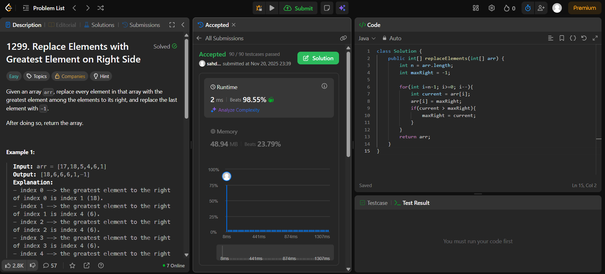

# 🧠 Day 11 – Arrays (Easy)

**📅 Date:** November 20, 2025  
**💻 Language:** Java  
**📚 Topic:** Arrays – Reverse Traversal & Element Replacement  

---

## ✅ Problems Solved
| Problem | LeetCode # | Description |
|:--|:--:|:--|
| [Replace Elements with Greatest Element on Right Side](https://leetcode.com/problems/replace-elements-with-greatest-element-on-right-side/) | #1299 | Replace every element in the array with the greatest element among the elements to its right, and replace the last element with `-1`. |

---

## 💡 Concepts Practiced
- Implemented **reverse traversal** to efficiently find right-side maximums  
- Used a **running `maxRight` variable** to store the largest element seen so far  
- Replaced elements **in-place** without extra space  
- Practiced **O(n)** time and **O(1)** space optimization  
- Strengthened understanding of **backward iteration and dynamic updates**

---

## 🧩 Output Screenshots
| Problem | Result |
|:--|:--|
| Replace Elements with Greatest Element on Right Side |  |

---

## 🏁 Summary

Day 11 of the **100 Days of DSA** ✅
Learned to use **reverse traversal and a running maximum tracker** for in-place element replacement.
Strengthened logical thinking in **array manipulation, dynamic updates, and space optimization** ⚡🔁