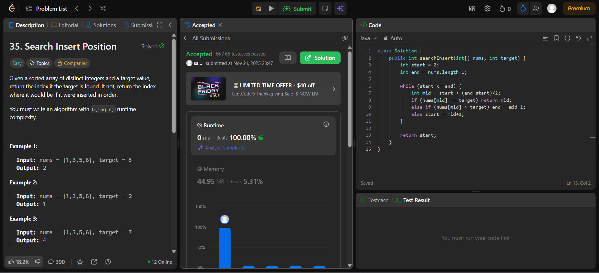

# 🧠 Day 12 – Binary Search (Easy)

**📅 Date:** November 21, 2025  
**💻 Language:** Java  
**📚 Topic:** Binary Search – Insertion Index & Search Optimization  

---

## ✅ Problems Solved
| Problem | LeetCode # | Description |
|:--|:--:|:--|
| [Search Insert Position](https://leetcode.com/problems/search-insert-position/) | #35 | Find the index where a target value should be inserted in a sorted array, or return the index if it already exists. |

---

## 💡 Concepts Practiced
- Applied the **binary search algorithm** on a sorted array  
- Used **midpoint calculation**: `mid = start + (end - start) / 2` to avoid overflow  
- Learned to handle **target insertion logic** when the element is not found  
- Practiced **logarithmic search** with **O(log n)** time complexity  
- Strengthened understanding of **index-based boundary updates**  

---

## 🧩 Output Screenshots
| Problem | Result |
|:--|:--|
| Search Insert Position |  |

---

## 🏁 Summary

Day 12 of the **100 Days of DSA** ✅
Implemented a **binary search** to efficiently locate or determine the correct insertion position in a sorted array.
Improved understanding of **midpoint logic, boundary handling, and algorithmic precision** ⚙️📈