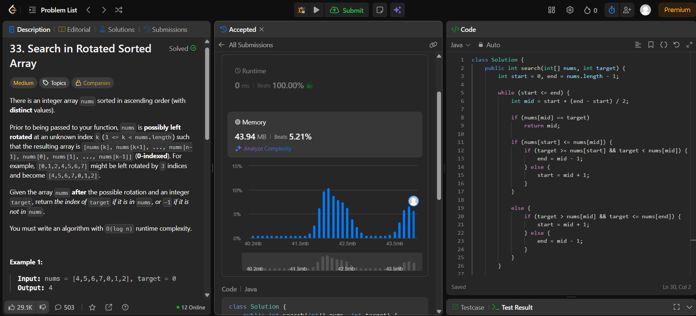

# 🧠 Day 13 – Binary Search (Medium)

**📅 Date:** November 22, 2025  
**💻 Language:** Java  
**📚 Topic:** Binary Search – Rotated Sorted Arrays & Conditional Partitioning  

---

## ✅ Problems Solved
| Problem | LeetCode # | Description |
|:--|:--:|:--|
| [Search in Rotated Sorted Array](https://leetcode.com/problems/search-in-rotated-sorted-array/) | #33 | Search for a target value in a rotated sorted array using a modified binary search approach. |

---

## 💡 Concepts Practiced
- Applied **modified binary search** on a **rotated sorted array**  
- Identified the **sorted half** (left or right) in each iteration  
- Compared **target position** relative to mid and boundary indices  
- Handled **rotation edge cases** efficiently  
- Achieved **O(log n)** time complexity with constant space  
- Strengthened logical reasoning in **partition-based searching**  

---

## 🧩 Output Screenshots
| Problem | Result |
|:--|:--|
| Search in Rotated Sorted Array |  |

---

## 🏁 Summary

Day 13 of the **100 Days of DSA** ✅
Implemented a **modified binary search** to locate a target in a rotated sorted array.
Enhanced understanding of **array partitioning, logical branching, and boundary analysis** 🔄📈