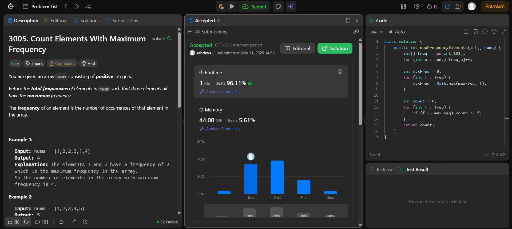

# 🧠 Day 2 – Arrays (Easy)

**📅 Date:** November 11, 2025  
**💻 Language:** Java  
**📚 Topic:** Arrays – Frequency & Rotation  

---

## ✅ Problems Solved
| Problem | LeetCode # | Description |
|:--|:--:|:--|
| [Count Elements With Maximum Frequency](https://leetcode.com/problems/count-elements-with-maximum-frequency/) | #3005 | Count total occurrences of elements that appear most frequently in the array. |
| [Rotate Array](https://leetcode.com/problems/rotate-array/) | #189 | Rotate the elements of an array to the right by `k` steps using reverse or cyclic approach. |

---

## 💡 Concepts Practiced
- Using **HashMap** for frequency counting  
- Identifying **maximum frequency elements** efficiently  
- Performing **array rotation using reverse method**  
- Understanding **modular arithmetic** for index shifting  
- Writing clean, modular methods in Java  

---

## 🧩 Output Screenshots
| Problem | Result |
|:--|:--|
| Count Elements With Maximum Frequency |  |
| Rotate Array |  |

---

## 🏁 Summary
Day 2 of the **100 Days of DSA** ✅  
Learned to handle array element frequencies using HashMaps and practiced in-place array manipulation techniques.  
Strengthened logical flow and code clarity in Java 🚀