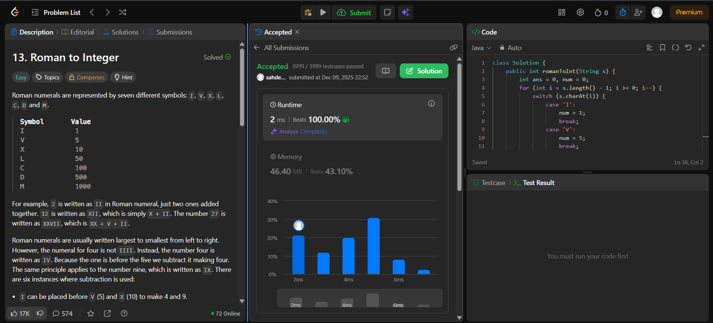

# 🧠 Day 25 – Math & Strings (Easy)

**📅 Date:** December 9, 2025  
**💻 Language:** Java  
**📚 Topic:** Roman Numerals – Parsing & Subtractive Logic  

---

## ✅ Problems Solved
| Problem | LeetCode # | Description |
|:--|:--:|:--|
| [Roman to Integer](https://leetcode.com/problems/roman-to-integer/) | #13 | Convert a Roman numeral string into its corresponding integer by applying additive and subtractive rules. |

---

## 💡 Concepts Practiced
- Parsed Roman numerals using **reverse traversal**  
- Converted symbols using a **switch-case mapping**  
- Used the subtractive logic rule:  
  - If `current < previous`, subtract  
  - Else, add  
- Applied an elegant condition: `4 * current < total` to detect subtractive cases  
- Achieved **O(n)** time and **O(1)** space  
- Strengthened understanding of ancient numeral systems & parsing logic  

---

## 🧩 Output Screenshots
| Problem | Result |
|:--|:--|
| Roman to Integer |  |

---

## 🏁 Summary
Day 30 of the **100 Days of DSA** ✅
Solved **Roman to Integer** using reverse traversal and clean subtractive logic.
Improved understanding of **symbol-value mapping, conditional subtraction, and string-based numeral processing** 🔢⚙️