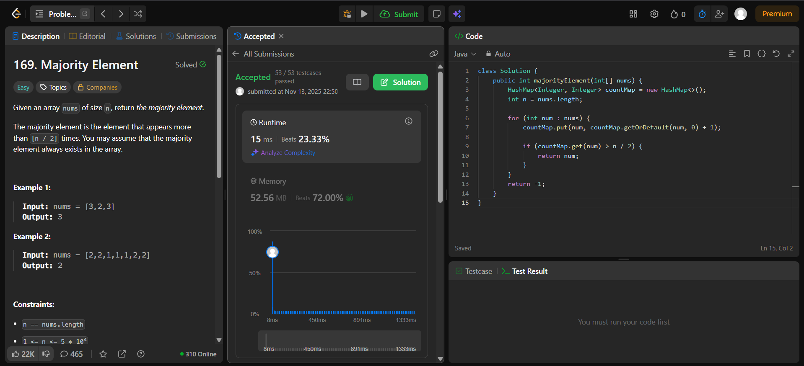

# 🧠 Day 4 – Arrays (Easy)

**📅 Date:**  november 13, 2025  
**💻 Language:** Java  
**📚 Topic:** Arrays – Majority Element  

---

## ✅ Problems Solved
| Problem | LeetCode # | Description |
|:--|:--:|:--|
| [Majority Element](https://leetcode.com/problems/majority-element/) | #169 | Find the element that appears more than ⌊ n/2 ⌋ times in the array using Boyer–Moore Voting Algorithm. |

---

## 💡 Concepts Practiced
- Implementing the **Boyer–Moore Voting Algorithm**  
- Understanding the concept of **majority element (> n/2 occurrences)**  
- Using **counting logic** to identify dominant elements  
- Comparing approaches: **HashMap vs. Voting Algorithm**  
- Optimizing for **O(n)** time and **O(1)** space complexity  

---

## 🧩 Output Screenshots
| Problem | Result |
|:--|:--|
| Majority Element | 

---

## 🏁 Summary
Day 4 of the **100 Days of DSA** ✅  
Learned to determine the **majority element** efficiently without extra space using the **Boyer–Moore Voting Algorithm**.  
Improved understanding of **count balancing** and **linear-time majority detection** ⚖️🚀