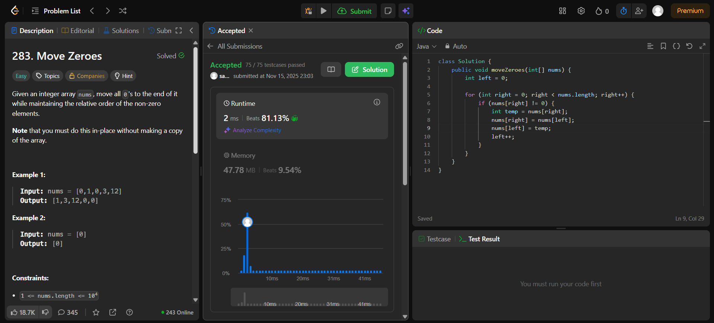

# 🧠 Day 6 – Arrays (Easy)

**📅 Date:** November 15, 2025  
**💻 Language:** Java  
**📚 Topic:** Arrays – Two Pointer Technique & Element Rearrangement  

---

## ✅ Problems Solved
| Problem | LeetCode # | Description |
|:--|:--:|:--|
| [Move Zeroes](https://leetcode.com/problems/move-zeroes/) | #283 | Move all zeroes to the end of the array while maintaining the relative order of non-zero elements. |

---

## 💡 Concepts Practiced
- Used the **two-pointer technique** for efficient in-place rearrangement  
- Separated **non-zero element placement** and **zero filling** for clarity  
- Maintained **relative order** of elements  
- Achieved **O(n)** time and **O(1)** space complexity  
- Practiced writing **clean, minimal, and efficient loops**

---

## 🧩 Output Screenshots
| Problem | Result |
|:--|:--|
| Remove Duplicates from Sorted Array |  |

---

## 🏁 Summary
Day 6 of the **100 Days of DSA** ✅
Implemented the **two-pointer approach** to move zeroes efficiently while preserving the order of non-zero elements.
Enhanced logical reasoning for **array traversal, in-place updates, and loop optimization** 🚀⚙️