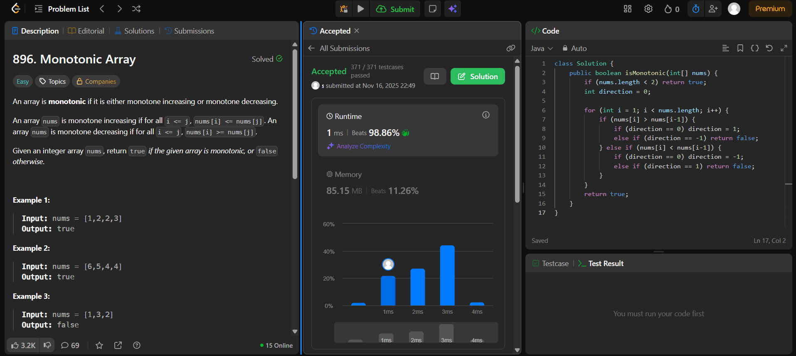

# 🧠 Day 7 – Arrays (Easy)

**📅 Date:** November 16, 2025  
**💻 Language:** Java  
**📚 Topic:** Arrays – Monotonic Sequences & Comparison Logic  

---

## ✅ Problems Solved
| Problem | LeetCode # | Description |
|:--|:--:|:--|
| [Monotonic Array](https://leetcode.com/problems/monotonic-array/) | #896 | Check whether a given array is **monotonic**, i.e., entirely non-increasing or non-decreasing. |

---

## 💡 Concepts Practiced
- Identifying **monotonic sequences** in arrays  
- Using a **direction variable** to track increasing/decreasing trends  
- Handling **equal consecutive elements** gracefully  
- Avoiding unnecessary flags or multiple passes  
- Practicing **O(n)** time and **O(1)** space solutions  

---

## 🧩 Output Screenshots
| Problem | Result |
|:--|:--|
| Monotonic Array |  |

---

## 🏁 Summary
Day 7 of the **100 Days of DSA** ✅
Learned to determine **monotonic behavior** in arrays using a single-pass, direction-tracking method.
Improved logical clarity and flow control for **comparison-based array problems** 📈📉⚙️