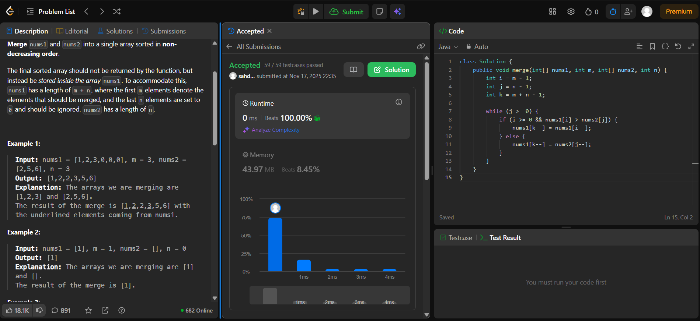

# 🧠 Day 8 – Arrays (Easy)

**📅 Date:** November 17, 2025  
**💻 Language:** Java  
**📚 Topic:** Arrays – Two Pointer Technique & In-Place Merge  

---

## ✅ Problems Solved
| Problem | LeetCode # | Description |
|:--|:--:|:--|
| [Merge Sorted Array](https://leetcode.com/problems/merge-sorted-array/) | #88 | Merge two sorted arrays `nums1` and `nums2` into a single sorted array, modifying `nums1` in-place. |

---

## 💡 Concepts Practiced
- Implemented the **two-pointer technique (from the end)**  
- Efficiently **merged arrays in-place** without extra space  
- Handled **array indices and boundaries** carefully  
- Practiced **O(m + n)** time and **O(1)** space optimization  
- Strengthened **backward traversal** and **conditional swapping logic**

---

## 🧩 Output Screenshots
| Problem | Result |
|:--|:--|
| Merge Sorted Array |  |

---

## 🏁 Summary
Day 8 of the **100 Days of DSA** ✅
Mastered **in-place merging** using the **reverse two-pointer** technique — starting from the end to avoid overwriting elements.
Enhanced skills in **index manipulation, conditional logic, and array integration strategies.** 🚀📊