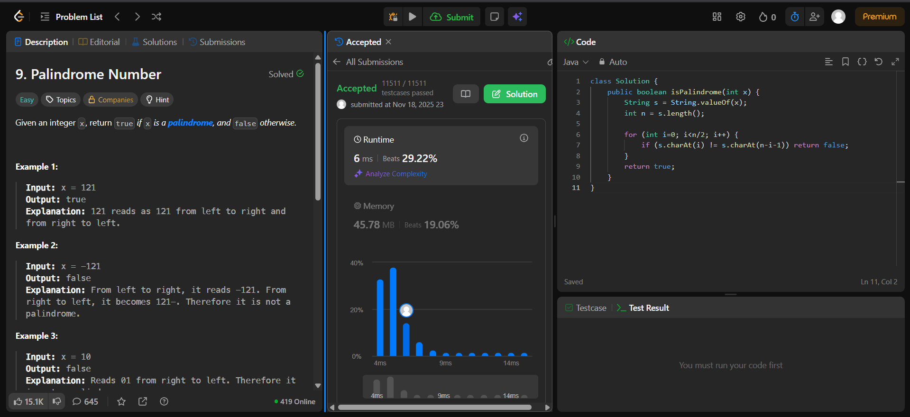

# 🧠 Day 9 – Math & Strings (Easy)

**📅 Date:** November 18, 2025  
**💻 Language:** Java  
**📚 Topic:** Palindromes – String Manipulation & Comparison  

---

## ✅ Problems Solved
| Problem | LeetCode # | Description |
|:--|:--:|:--|
| [Palindrome Number](https://leetcode.com/problems/palindrome-number/) | #9 | Determine whether an integer is a palindrome without using extra data structures. |

---

## 💡 Concepts Practiced
- Converted integers to **strings** for simplified comparison  
- Checked **symmetry** using two-pointer traversal (`i` and `n-i-1`)  
- Practiced **character-based comparison** in loops  
- Reinforced logic for **palindrome detection** and **string indexing**  
- Explored a **clean O(n)** time and **O(1)** space approach (excluding string conversion)

---

## 🧩 Output Screenshots
| Problem | Result |
|:--|:--|
| Monotonic Array |  |

---

## 🏁 Summary

Day 9 of the **100 Days of DSA** ✅
Solved the **Palindrome Number** problem using a **string-based symmetric comparison method**.
Improved understanding of **loop boundaries, character indexing, and palindrome logic** 🔁✨